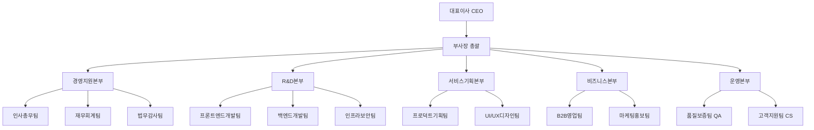

```mermaid
graph TD
    CEO[대표이사 CEO] --> VP[부사장 총괄]
    VP --> D1[경영지원본부]
    VP --> D2[R&D본부]
    VP --> D3[서비스기획본부]
    VP --> D4[비즈니스본부]
    VP --> D5[운영본부]

    D1 --> T1_1[인사총무팀]
    D1 --> T1_2[재무회계팀]
    D1 --> T1_3[법무감사팀]

    D2 --> T2_1[프론트엔드개발팀]
    D2 --> T2_2[백엔드개발팀]
    D2 --> T2_3[인프라보안팀]

    D3 --> T3_1[프로덕트기획팀]
    D3 --> T3_2[UI/UX디자인팀]

    D4 --> T4_1[B2B영업팀]
    D4 --> T4_2[마케팅홍보팀]

    D5 --> T5_1[품질보증팀 QA]
    D5 --> T5_2[고객지원팀 CS]
```
