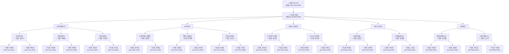

```mermaid
graph TD
    CEO["👑 대표이사 CEO<br>김대표 (010-1000-0001)"] --> VP["👑 부사장 총괄<br>이총괄 (010-2000-0001)"]

    VP --> D1[경영지원본부]
    VP --> D2[R&D본부]
    VP --> D3[서비스기획본부]
    VP --> D4[비즈니스본부]
    VP --> D5[운영본부]

    %% 1. 경영지원본부 산하 팀 및 팀원
    D1 --> T1_1["인사총무팀<br>👑 팀장: 김인사"]
    T1_1 --> T1_1_M1["👤 팀원: 이사원<br>(010-1111-1001)"]
    T1_1 --> T1_1_M2["👤 팀원: 박대리<br>(010-1111-1002)"]

    D1 --> T1_2["재무회계팀<br>👑 팀장: 박재무"]
    T1_2 --> T1_2_M1["👤 팀원: 최사원<br>(010-1111-2001)"]
    T1_2 --> T1_2_M2["👤 팀원: 정과장<br>(010-1111-2002)"]

    D1 --> T1_3["법무감사팀<br>👑 팀장: 최법무"]
    T1_3 --> T1_3_M1["👤 팀원: 강대리<br>(010-1111-3001)"]
    T1_3 --> T1_3_M2["👤 팀원: 조주임<br>(010-1111-3002)"]

    %% 2. R&D본부 산하 팀 및 팀원
    D2 --> T2_1["프론트엔드개발팀<br>👑 팀장: 정프론"]
    T2_1 --> T2_1_M1["👤 팀원: 윤사원<br>(010-2222-1001)"]
    T2_1 --> T2_1_M2["👤 팀원: 장주임<br>(010-2222-1002)"]

    D2 --> T2_2["백엔드개발팀<br>👑 팀장: 강백엔"]
    T2_2 --> T2_2_M1["👤 팀원: 임대리<br>(010-2222-2001)"]
    T2_2 --> T2_2_M2["👤 팀원: 한과장<br>(010-2222-2002)"]

    D2 --> T2_3["인프라보안팀<br>👑 팀장: 조인프"]
    T2_3 --> T2_3_M1["👤 팀원: 송사원<br>(010-2222-3001)"]
    T2_3 --> T2_3_M2["👤 팀원: 오주임<br>(010-2222-3002)"]

    %% 3. 서비스기획본부 산하 팀 및 팀원
    D3 --> T3_1["프로덕트기획팀<br>👑 팀장: 윤기획"]
    T3_1 --> T3_1_M1["👤 팀원: 신사원<br>(010-3333-1001)"]
    T3_1 --> T3_1_M2["👤 팀원: 권대리<br>(010-3333-1002)"]

    D3 --> T3_2["UI/UX디자인팀<br>👑 팀장: 장디잔"]
    T3_2 --> T3_2_M1["👤 팀원: 황사원<br>(010-3333-2001)"]
    T3_2 --> T3_2_M2["👤 팀원: 안주임<br>(010-3333-2002)"]

    %% 4. 비즈니스본부 산하 팀 및 팀원
    D4 --> T4_1["B2B영업팀<br>👑 팀장: 임영업"]
    T4_1 --> T4_1_M1["👤 팀원: 백대리<br>(010-4444-1001)"]
    T4_1 --> T4_1_M2["👤 팀원: 류과장<br>(010-4444-1002)"]

    D4 --> T4_2["마케팅홍보팀<br>👑 팀장: 한마켓"]
    T4_2 --> T4_2_M1["👤 팀원: 허사원<br>(010-4444-2001)"]
    T4_2 --> T4_2_M2["👤 팀원: 고주임<br>(010-4444-2002)"]

    %% 5. 운영본부 산하 팀 및 팀원
    D5 --> T5_1["품질보증팀 QA<br>👑 팀장: 송품질"]
    T5_1 --> T5_1_M1["👤 팀원: 문사원<br>(010-5555-1001)"]
    T5_1 --> T5_1_M2["👤 팀원: 남대리<br>(010-5555-1002)"]

    D5 --> T5_2["고객지원팀 CS<br>👑 팀장: 오고객"]
    T5_2 --> T5_2_M1["👤 팀원: 지주임<br>(010-5555-2001)"]
    T5_2 --> T5_2_M2["👤 팀원: 하사원<br>(010-5555-2002)"]
```
