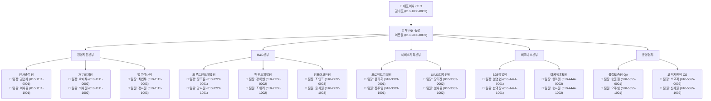

```mermaid
graph TD
    CEO["👑 대표이사 CEO<br>김대표 (010-1000-0001)"] --> VP["👑 부사장 총괄<br>이총괄 (010-2000-0001)"]

    VP --> D1[경영지원본부]
    VP --> D2[R&D본부]
    VP --> D3[서비스기획본부]
    VP --> D4[비즈니스본부]
    VP --> D5[운영본부]

    D1 --> T1_1["인사총무팀<br>👑 팀장: 김인사 (010-1111-0001)<br>👤 팀원: 이사원 (010-1111-1001)"]
    D1 --> T1_2["재무회계팀<br>👑 팀장: 박재무 (010-1111-0002)<br>👤 팀원: 최사원 (010-1111-1002)"]
    D1 --> T1_3["법무감사팀<br>👑 팀장: 최법무 (010-1111-0003)<br>👤 팀원: 정사원 (010-1111-1003)"]

    D2 --> T2_1["프론트엔드개발팀<br>👑 팀장: 정프론 (010-2222-0001)<br>👤 팀원: 강사원 (010-2222-1001)"]
    D2 --> T2_2["백엔드개발팀<br>👑 팀장: 강백엔 (010-2222-0002)<br>👤 팀원: 조대리 (010-2222-1002)"]
    D2 --> T2_3["인프라보안팀<br>👑 팀장: 조인프 (010-2222-0003)<br>👤 팀원: 윤사원 (010-2222-1003)"]

    D3 --> T3_1["프로덕트기획팀<br>👑 팀장: 윤기획 (010-3333-0001)<br>👤 팀원: 장주임 (010-3333-1001)"]
    D3 --> T3_2["UI/UX디자인팀<br>👑 팀장: 장디잔 (010-3333-0002)<br>👤 팀원: 임사원 (010-3333-1002)"]

    D4 --> T4_1["B2B영업팀<br>👑 팀장: 임영업 (010-4444-0001)<br>👤 팀원: 한과장 (010-4444-1001)"]
    D4 --> T4_2["마케팅홍보팀<br>👑 팀장: 한마켓 (010-4444-0002)<br>👤 팀원: 송사원 (010-4444-1002)"]

    D5 --> T5_1["품질보증팀 QA<br>👑 팀장: 송품질 (010-5555-0001)<br>👤 팀원: 오주임 (010-5555-1001)"]
    D5 --> T5_2["고객지원팀 CS<br>👑 팀장: 오고객 (010-5555-0002)<br>👤 팀원: 신사원 (010-5555-1002)"]
```
